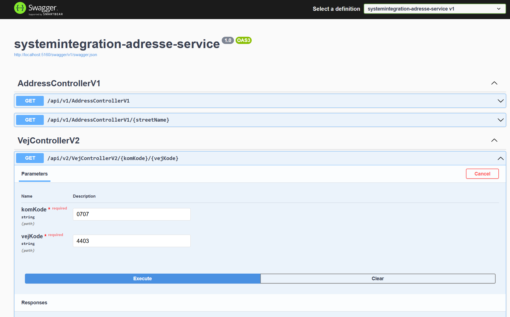
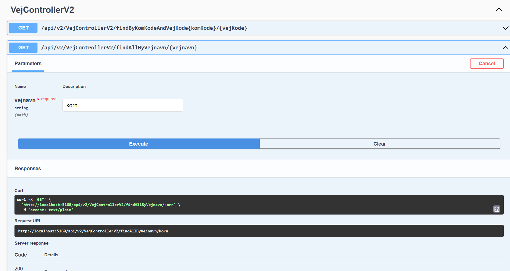

# Opsætning

Koden antager at datafilen A370715.txt er på C:\A370715.txt

# Kørsel via swagger

Programmet kan køres enten via. IISEXPRESS eller kestrel.  

Swagger page er tilgængelig på http://localhost:5160/swagger/index.html  

V2 anbefales  







# Kørsel via curl

Hvis det er lige lovlig meget arbejde at åbne en browser, så er curl også muligt:

### find by komkode and vejkode
```curl
curl -X 'GET' 'http://localhost:5160/api/v2/VejControllerV2/findByKomKodeAndVejKode0707/4403' -H 'accept: text/plain'
```

### find by vejnavn
```curl
curl -X 'GET' 'http://localhost:5160/api/v2/VejControllerV2/findAllByVejnavn/korn' -H 'accept: text/plain'
```

----

# Fortolkning af data

Umiddelbart er der to måder at agere udfra opgavens beskrivelse.  
Enten behandler man eksplicit AktVej, eller også grupperer man data.  
  
At mappe de individuelle datatyper uden at sammenkoble dem tilføjer ingen værdi.  
Dette præmis er V1 bygget udfra.  
V2 bygger på sammenkobling af de forskellige data:


Se data nedunder:
001 beskriver vejen  
  
004 beskriver postdistrikter, hhv. lige og ulige, fra og til.
009 beskriver kirkedistrik(er), en vej kan strække sig på tværs af kirkedistriker.  
  
Alle distrikter har associationerne 0..*, da en vej kan strække sig på tværs af distrikter.  
  
Et godt eksempel på en vej med mange associationer er Århusvej, der strækker sig igennem mange områder i Norddjurs kommune
001070797902018112217000000000000000000201811220000 Århusvej             Århusvej                                
00307079790164 164 L202003171010Hessel                            
00307079790170 170 L202003171010 ls                               
00307079790178 184 L202003171010Lund                              
00307079790190 282 L202003171010Trustrup                          
00307079790284 292 L202003171010Obdrup                            
00307079790075 075 U202003171010Hessel                            
00307079790077 079 U202003171010 ls                               
00307079790089 089 U202003171010Hom                               
00307079790113 115 U202003171010Lyngdal                           
00307079790117 135 U202003171010Lund                              
00307079790141 219 U202003171010Trustrup                          
00307079790221B235 U202003171010Obdrup                            
00407079790004 170 L2018092921108500Grenaa              
00407079790178 292 L2018092921108570Trustrup            
00407079790001 089 U2018092921108500Grenaa              
00407079790113 235 U2018092921108570Trustrup            
00907079790004 146 L20211001000816Grenaa                        
00907079790164 170 L20211001000806 ls                           
00907079790178 184 L20211001000809Hom                           
00907079790190 292 L20211001000810Lyngby-Alb ge                 
00907079790001 063 U20211001000816Grenaa                        
00907079790073 079 U20211001000806 ls                           
00907079790089 135 U20211001000809Hom                           
00907079790141 235 U20211001000810Lyngby-Alb ge                 
01307079790004 146 L2021100100088231Grenaa,Norddjurs    
01307079790164 170 L2021100100088166 ls ,Norddjurs      
01307079790178 184 L2021100100088169Hom ,Norddjurs      
01307079790190 292 L2021100100089327Lyngby-Alb ge, Ndjur
01307079790001 063 U2021100100088231Grenaa,Norddjurs    
01307079790073 079 U2021100100088166 ls ,Norddjurs      
01307079790089 135 U2021100100088169Hom ,Norddjurs      
01307079790141 235 U2021100100089327Lyngby-Alb ge, Ndjur
01407079790004 146 L20200317101001Kulturhuset Pavillonen        
01407079790164 170 L20200317101004Grenaa Idr tscenter           
01407079790178 292 L20200317101003Kulturhuset Stationen         
01407079790001 063 U20200317101001Kulturhuset Pavillonen        
01407079790073 079 U20200317101004Grenaa Idr tscenter           
01407079790089 235 U20200317101003Kulturhuset Stationen  

# Designvalg  
 
Udfra https://cpr.dk/cpr-nyt/nyhedsarkiv/2013/aug/kommunale-distrikter er der valgt *IKKE* at mappe følgende modeller:  
  
- 006 BYFORNYELSE KODER
- 007 DIVERSE DISTRIKTER
- 008 EVAKUERINGS KODER
- 010 SKOLE KODER
- 011 BEFOLKNING KODER
- 012 SOCIAL KODER
- 015 VARME KODER

# V1

Som du, Ove, nok kan regne ud så havde jeg lavet den doven løsning først. Den, ifølge mit hoved, opfylder kriterierne..   
Men som begge ved, så er der ikke meget værdi i det data det returnerer.

# V2

I denne version er der udarbejdet en datastruktur på baggrund af dataformatet af CPR filen.  
Den behandler AktVej som den primære data type, hvor alle andre typer anses som sekundære berigelses klasser.  

# Forslag til forbedringer
Implementation af caching på vha. et Dictionary som holder på med KomKode som value, og value være Listen af Veje for den pågælende kommune.
